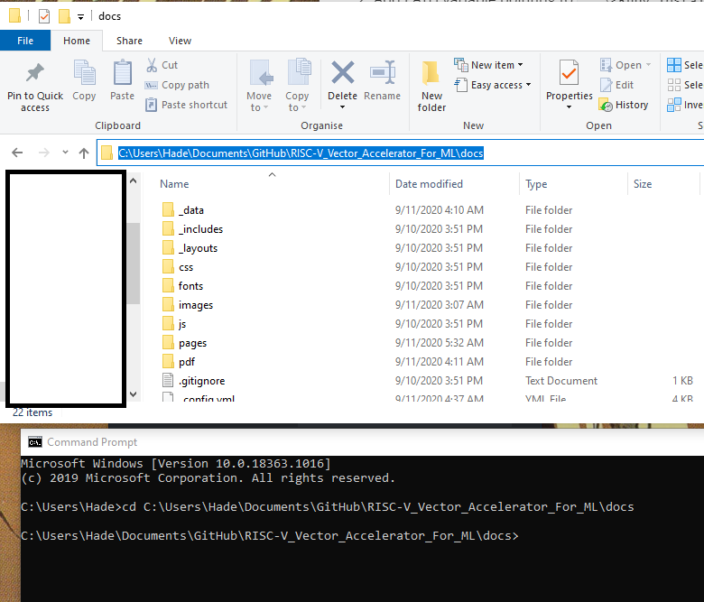

## Installing Ruby & Building Website locally

### Windows

- Install Ruby+Devkit from [here](https://rubyinstaller.org/downloads/). Make sure to select a recent version including the DEVKIT (i.e.  One of the '*WITH DEVKIT*' downloads). Make sure to run the `ridk install` step on the last stage of the installation.


- Add PATH variable pointing to `...\<Ruby Installation Folder>\bin`, this folder is usually located in `C:\<Ruby Version>\bin`


- Open a CMD session, and Install Jekyll and Bundler using the command  `gem install jekyll bundler`. To make sure that jekyll was properly installed, you can try to type `jekyll -v` and it will display your current jekyll version.


- Clone our repository available [here](https://github.com/imadassir/RISC-V_Vector_Accelerator_For_ML).


- Open a CMD session and Navigate to `.../<Repository Folder>/docs` 



- Use the command `bundle exec jekyll serve` to build the website. I will be made available locally at http://localhost:4000.


### Linux

- Steps to install under Linux, and more specifically Ubuntu, can be found [here](https://jekyllrb.com/docs/installation/ubuntu/).

## Adding Documentation to the Website

- Write your documentation in a Markdown file using your favourite text-editor (extension .md). There are many examples of existing documentation under `.../docs/pages`
- Add a YAML header to your documentation file. You can follow this template:

```YAML
---

title: "<Your Title>"

sidebar: riscv_vector_processor_design_sidebar

permalink: <Title>.html

folder: <Associated Folder>

---
```

- Go to `.../docs/data/sidebars` and open the file `riscv_vector_processor_design_sidebar.yml`. Add an entry corresponding to the documentation you've just added. Make sure to respect indentation, as they represent categories/articles relations, and to add proper titles and permalinks.
- Voila! Make sure to save your changes and test locally, then push your changes to the Github repository.