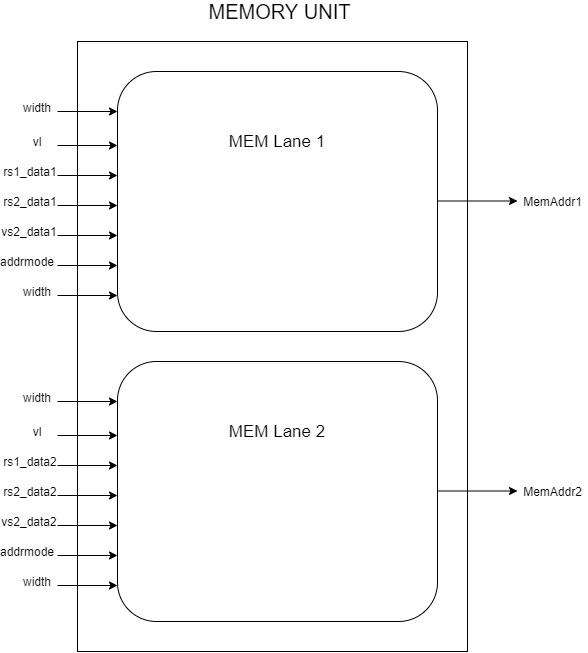

### Description

The memory lane computes the 32-bit address based on the desired addressing mode, transfer size and some control signals. It is composed of lanes, similar to the ALU unit. Refer to Appendix B for the list of supported memory instructions.

### Implementation

Contrary to the ALU unit, the memory unit is clocked since it needs to increment and feed a new address to memory every clock cycle.

### Diagram

